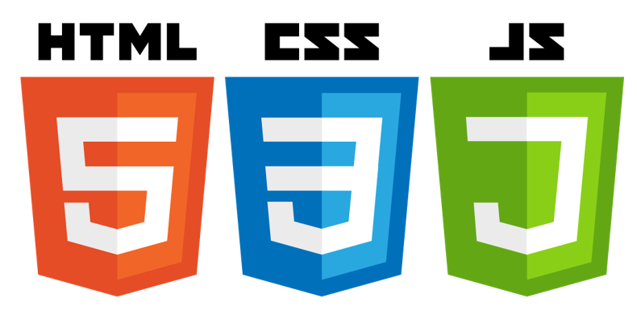
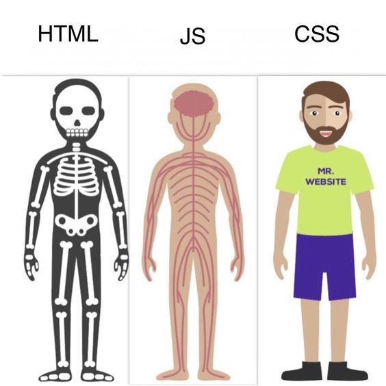
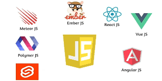

# ¿Qué tecnologías se usan en FrontEnd?

El FrontEnd tiene muchísimos sabores y existen cientos de formas de hacer que tengas una página o aplicación web, y eso sin contar que también podríamos considerar como FrontEnd las aplicaciones móviles o de escritorio en toda su sección de interfaces.

Para el caso específico del curso estaremos utilizando principalmente 3 tecnologías y sus variantes, estas son: HTML, CSS y JavaScript.

## HTML

Este lenguaje nos permite tener el esqueleto de nuestra aplicación, es lo que define la estructura del sitio y lo que nos da la pauta y el inicio de nuestra aplicación web.

Esto es lo que veremos en el siguiente módulo del curso.

## CSS

Este lenguaje nos da la posibilidad de estilizar y de insertarle toda la parte de visual y estética a tu sitio como si fuera la piel de nuestra aplicación.

Se utilizan clases y selectores para poder definir las propiedades y características de cada uno de los elementos que nosotros definamos en la aplicación web.

## JavaScript

Es el cerebro de nuestra plataforma, una vez que nosotros utilizamos JS en el sitio le damos la capacidad de escalar las funcionalidades de forma exponencial, ya que pasamos de las propiedades que tienen las etiquetas (Que también tienen algo de JS) a tener una cantidad virtualmente infinita de posibilidades.

Podemos considerar a JS como el sistema nervioso que controla toda nuestra aplicación web y la que manejará todos los músculos y huesos de nuestro sitio.

Esta imagen es una metáfora bastante acertada de cómo funcionan estas 3 tecnologías básicas de FrontEnd

## Frameworks

Los Frameworks son variantes de JS que nos ayudan a que nuestra programación pueda llegar a ser mucho más rápida o con algunas funcionalidades adicionales a Vanilla JS, esto aplica tanto para FrontEnd como para Backend.

El hecho de que un Framework te permita programar de forma más sencilla NO SIGNIFICA que puedes saltarte toda la parte fundamental de JS, esto es porque al ser la base de muchos de los Frameworks web, es bastante útil conocer como funciona desde el fondo.

Existen muchos Frameworks y librerías muy famosos, pero por mencionar algunos de FrontEnd están React JS, Vue JS, Angular, Ember JS, Svelte, entre otros.

Adicional a estos también existen Frameworks para Backend, como por ejemplo NodeJS (Que de hecho es una de las opciones a seleccionar para tu siguiente misión)

Eso es todo por esta lección, nos vemos en la [siguiente](./3.-webDevSetup.md).

***¡Vámonos hasta el espacio y más allá Explorers!***
