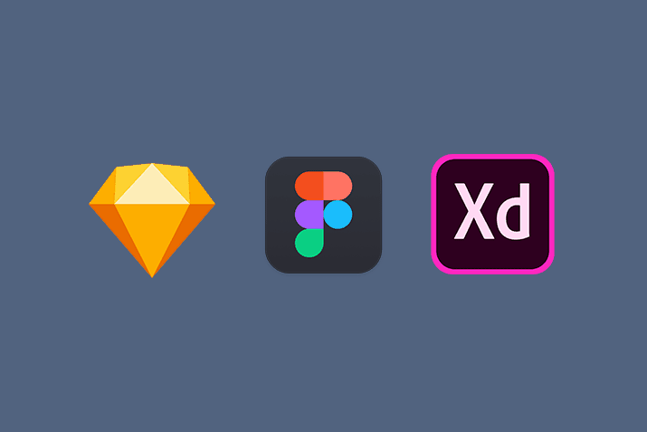
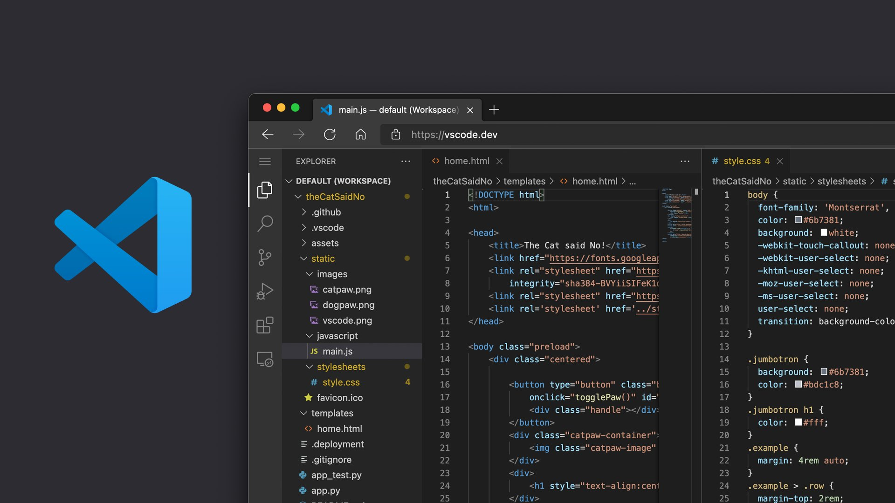
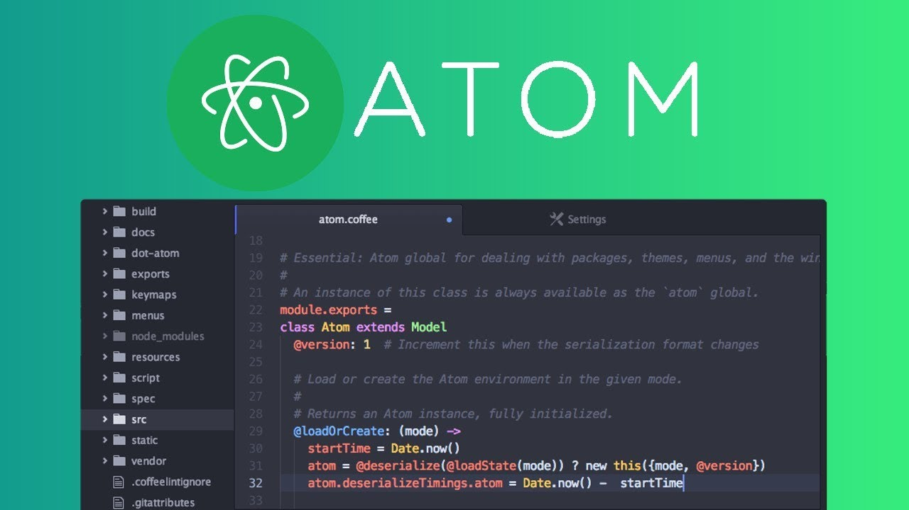
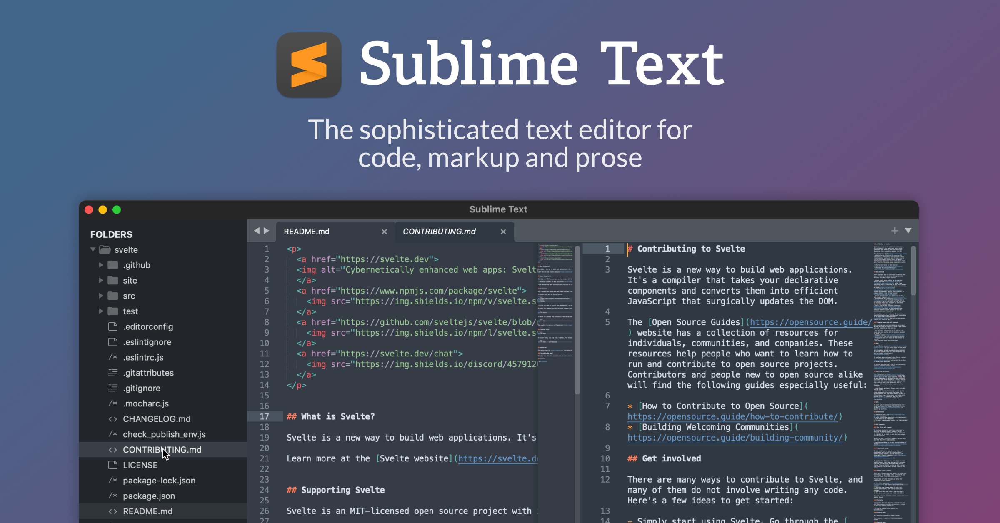
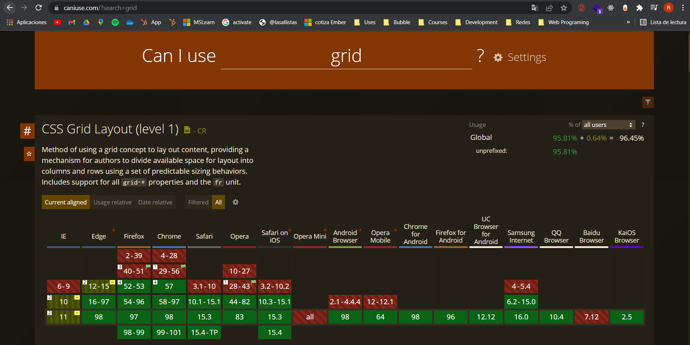
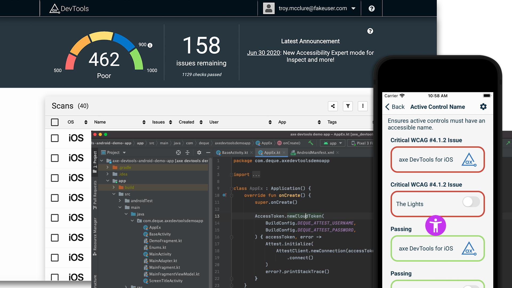
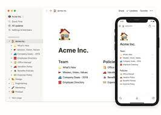
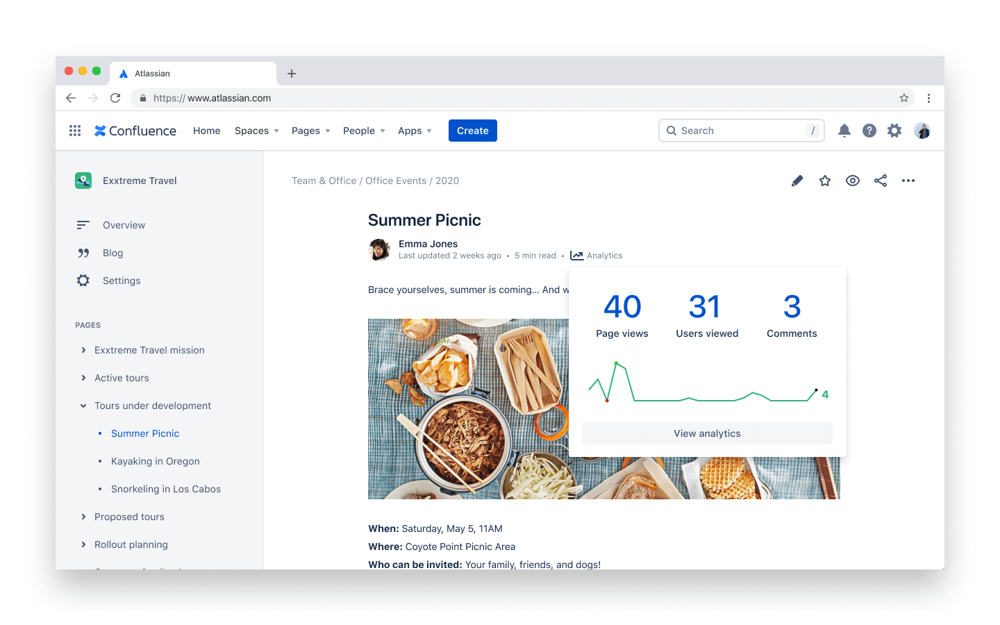

# Setup de un programador FrontEnd

¡Hola Explorers!
En cualquiera de las profesiones a las que nos dediquemos necesitamos herramientas poderosas que nos ayuden a hacer realidad nuestros más grandes sueños.

En el caso específico de programación web y específicamente FrontEnd lo que utilizaremos es lo siguiente:

- Herramienta de diseño de aplicación
- IDE de programación
- Navegador web
- Diferentes opciones de "Developer tools"
- Herramienta de documentación

Algunas de las herramientas podrían ser opcionales o en un ámbito profesional podrían ser utilizadas por otras áreas de la empresa, sin embargo, es importante que ustedes las conozcan para que en el flujo operativo de la empresa, su aporte sea mucho más valioso.

## Herramienta de diseño

Esta herramienta es la que nos da la capacidad de tener un prototipo sin poner NI UNA línea de código.

En el flujo de programación, basándonos en el SDLC (Software Development Life Cycle) siempre es necesario empezar con el diseño de la solución antes de irnos directo a programarla, esto se hace así porque en caso de haber un cambio o modificación es mucho más fácil y rápido cambiarla en el lado de diseño que volver a programar el módulo completo.

El diseño tiene como objetivo poder aterrizar los requerimientos de quien nos esté pidiendo el software y para eso existen diferentes técnicas como por ejemplo: Desing Thinking, Visual Thinking, diagramas de flujo, o la que mejor se te acomode para poder entender lo más cercano posible a lo que tu cliente esté pidiendo.

En cuanto a las opciones, existen muchas herramientas de diseño; desde Paint, Canva, Photoshop, Illustrator, Publisher o cualquier cuaderno que tengamos en casa, pero existen herramientas especializadas y enfocadas al diseño de wireframes e interfaces gráficas las cuales idealmente deberíamos usar para este caso. 

Antes de adentrarnos en las herramientas recordemos que primero necesitamos poder aterrizar la idea y los requerimientos, para esto existe toda una fase previa a la estética de nuestra aplicación, esta fase es fundamental, ya que si no la realizamos podríamos encontrarnos obstáculos en el camino después. Esta es la fase de diseño de flujo y de WireFrame, lo que haremos en esta fase es entender las necesidades y empezar a dibujar como funciona la aplicación sin darle diseño gráfico aún, esta es una fase completamente funcional para darnos cuenta de las interacciones, los botones necesarios, el número de clicks y los diferentes movimientos de la aplicación y nos dará muchísima información para que nuestra aplicación sea lo más fluida posible.

Para esta fase de flujos y Wireframe existen diferentes herramientas como las siguientes:

- Miro (https://miro.com/es/) Esta herramienta te permitirá crear flujos de información y flujos de negocio.
- Balsamic mockups (https://balsamiq.com/wireframes/) Nos da elementos para poder crear interfaces rápidas y que nos dejan representar la idea.
- Dibujos a mano alzada --> a veces un wireframe también puede ser en una servilleta o en cualquier forma escrita. 

Una vez realizado tu wireframe pasaremos a la parte de UI/UX, en este momento comenzaremos con toda la parte gráfica, de identidad y de uso de colores, formas e interacciones a lo largo de nuestra aplicación, para eso podemos usar cualquiera de las siguientes herramientas.

- Sketch (https://www.sketch.com/) Esta herramienta solo aplica si tienes una computadora MacOS, pero cuenta con una amplia gama de características enfocadas a diseñadores, lo que hace que se puedan crear cosas muy grandes y escalables.

- Figma (https://www.figma.com/) Esta herramienta es gratuita en muchas de sus características y permite colaboración entre usuarios, lo que es muy útil cuando se trabaja en equipo, tanto en equipos de diseño como en equipos de desarrollo.

- Adobe XD (https://www.adobe.com/mx/products/xd.html) Existe su versión de prueba gratuita que te dejará ocupar la herramienta completa para crear todos tus diseños y el costo para tener un plan pro no es muy alto, tiene la ventaja de estar basado en las herramientas de Adobe, por lo que si ya tienes experiencia con alguna de estas herramientas, la curva de aprendizaje podría ser más corta.

Cualquiera de estas 3 últimas nos sirven también para la fase de wireframe y diseños de flujo, pero están más enfocadas hacia la parte de agregar diseño gráfico a los flujos realizados.

## IDE de programación

Un IDE (Integrated Development Environment) es un software que nos ayuda a los desarrolladores a poder construir aplicaciones de forma más sencilla, esto es porque combina diferentes herramientas de desarrollo en una sola interfaz gráfica.

- Editor de código: Un simple editor de texto que te ayuda a escribir software, tiene características útiles como: resaltar la sintaxis, encontrar algunos problemas dependiendo del lenguaje o autocompletando para que tu experiencia sea mejor.
- Automatización: Algunos IDEs tienen la posibilidad de automatizar tareas repetitivas como el despliegue de tu programa, la compilación o incluso la actualización de versiones.
- Depuración: Al tener toda la experiencia con lenguajes de programación, hay algunos IDEs que te ayudan a identificar errores o bugs antes de que se compile, e incluso hay algunos que te dan la solución o recomendaciones para que eso no pase.
- Integración: Existen herramientas que nos permiten integrar nuestro IDE de forma directa con su aplicación como lo son las interfaces, versionamientos de código o herramientas de despliegue.

Existen muchas y diferentes opciones, algunas enfocadas a un solo lenguaje y otras que son más abiertas y debes de utilizar el que se adapte mejor a la necesidad que se te presente.

Te dejo algunos ejemplos de IDEs para que puedas escoger el que más te guste.

A mi en lo personal me gusta mucho Visual Studio Code por todas las extensiones que tiene y las integraciones sencillas con diferentes tecnologías de Azure, Github, entre otras https://code.visualstudio.com/, además lo puedes usar en el navegador sin necesidad de instalarlo https://vscode.dev/

Adicional a este IDE también he utilizado Atom, el cual tiene una alta capacidad de personalización, así como también diferentes integraciones con herramientas de despliegue https://atom.io/ 

Igualmente si buscas una opción más simple, existe el editor de texto Sublime Text, es una herramienta que se utiliza mucho al inicio, pero que no cuenta con todas las integraciones y automatizaciones que te dan los primeros 2 https://www.sublimetext.com/ 

## Navegador web

Al ser programadores web todo lo que programemos se desplegará en un navegador web, aquí hay que tener mucho cuidado y revisar que la tecnología que estemos utilizando es compatible y se despliega de forma igual o similar en todos los navegadores.

Recordemos que todo lo que hacemos es para nuestro usuario y si a nuestro usuario le gusta usar un navegador u otro, nuestra aplicación deberá de ser capaz de brindarle los servicios, independientemente del navegador en el que se encuentre.

Tenemos Navegadores desde Internet Explorer, Chrome, Brave, Safari, Firefox, Edge, Opera y muchísimos más que hacen diferentes interpretaciones al código que nosotros programemos, es por eso que siempre es importante revisar la compatibilidad.

Para eso existen plataformas como "Can I use" https://caniuse.com/, la cual nos dice en que navegadores podemos utilizar la tecnología de HTML, CSS y JS que queramos utilizar.

Antes de decidir que tecnología vamos a implementar es importante saber a que usuarios vamos dirigidos y poder conocer los navegadores más utilizados por ellos, tanto en ambientes de escritorio como móviles.

## Developer tools

Cuando hablamos de las Developer tools ya *no* nos referimos a todo lo que estamos viendo como parte del SetUp que necesitamos para programar y desarrollar nuestras aplicaciones.

En este caso nos referimos a herramientas adicionales que nos dan información sobre nuestra aplicación y mejoras que podemos implementarle. 

Una de las más conocidas y usadas es Lighthouse de Google (https://developers.google.com/web/tools/lighthouse?hl=es) , la podemos encontrar directamente en el navegador y nos dará una auditoría del status de nuestro sitio en diferentes áreas como rendimiento, accesibilidad, buenas prácticas y SEO.

Si bien es de las más conocidas, no es la única y algo que debemos de tomar muy en cuenta es la parte de Accesibilidad en nuestros desarrollos, la democratización de la tecnología no solo significa que todos puedan tener acceso a ella, sino que también la puedas aprovechar independientemente de si tienes alguna condición física que no te permita interactuar con ella.

Pensemos en las personas que tienen debilidad visual o que son completamente ciegas usando nuestra aplicación web o personas que tienen algun problema motriz y que no pueden tocar todos los botones de nuestro sitio.

Estas personas también pueden ser nuestros usuarios y es nuestro deber como desarrolladores integrar las facilidades de accesibilidad a nuestras plataformas ayudando así a la democratización de la tecnología.

Para esto existen herramientas específicas que nos darán todas las guías y usos adecuados de accesibilidad para los usuarios como axe DevTools (https://www.deque.com/axe/devtools/) que puedes instalar como una extensión en tu navegador y te dará mucha información sobre cuales son los problemas en tu desarrollo, pero lo más importante, información sobre como solucionarlos.

## Documentación

Una de las fallas más grandes que me ha tocado ver a lo largo de mi carrera es que no se documentan los desarrollos, esto es bastante grave, ya que en caso de que se cambie de desarrollador o de que sea un programa que tiene mucho tiempo que no mueves, necesitas conocer y entender como fue desarrollado. 

En el ámbito profesional tu proyecto no será considerado a menos que esté bien documentado y cuando eres parte de un equipo de desarrollo la documentación es la forma más sana de comunicarte con todo el equipo.

La falta de documentación hace que la mantenibilidad del código sea mucho más complicada y que muchas veces se tenga que reprogramar los módulos ya que en promedio si no usas el código en aproximadamente 6 meses, dejarás de comprender su funcionalidad.

Para esto existen librerías como API Doc (https://apidocjs.com/) o como rails Admin (https://github.com/railsadminteam/rails_admin) que nos dan facilidades para documentar mientras programamos.

Lo que es importante considerar al momento de documentar tu código es lo siguiente:

- Definir tu audiencia: A quien va a ir dirigida tu documentación, si es para otros desarrolladores, de que nivel o si es para alguien administrativo o si incluso es para ti mismo en un futuro.
- Qué problemática soluciona tu código: Todo lo que programamos tiene una funcionalidad por módulo y necesitamos definir que parte de la aplicación afecta, en que forma y cuales son las opciones de entrada y salida de nuestras funciones.
- Estructura de aplicación: Cuando documentamos todo un proyecto tendremos diferentes secciones, funcionalidades, páginas o incluso otros sitios que se conecten al nuestro, para esto es recomendable documentar desde lo más general a lo particular, un ejemplo muy bueno lo podemos encontrar en la documentación de Firebase (https://firebase.google.com/docs/build)

Una herramienta muy útil para poder lograr esta estructura es Notion (https://www.notion.so/)

Otra herramienta que igualmente es adaptable y está enfocada hacia desarrolladores por la parte de seguimiento de sprints por parte de Atlassian es Confluence (https://www.atlassian.com/es/software/confluence)

Estas son herramientas que te pueden servir a darle mucha más formalidad a tu proyecto y que hará que tengas más orden en todos tus proyectos y en lo profesional tu valor aumentará de forma muy relevante.

Eso es todo por esta lección, nos vemos en la [siguiente](./4.-estructuraWeb.md)

***¡Vámonos hasta el espacio y más allá Explorers!***
