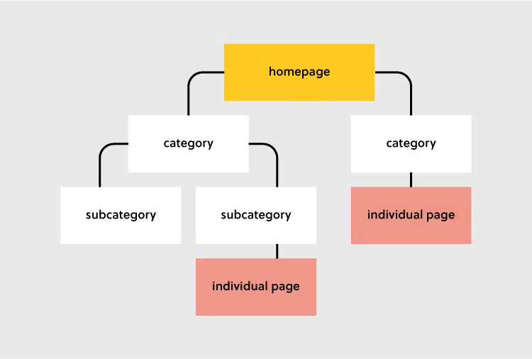
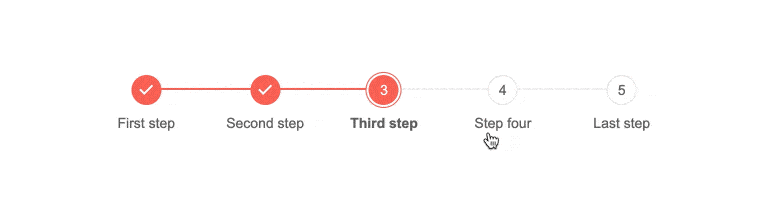
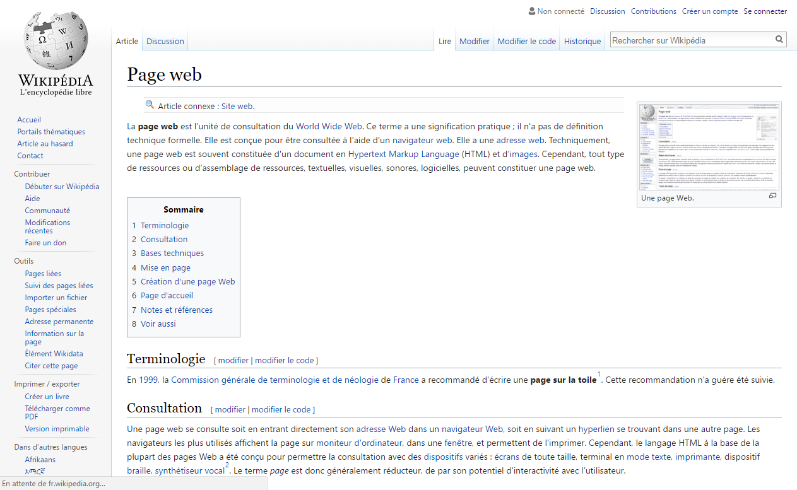

# Estructura Web

En este módulo veremos como están estructurados los sitios para que los usuarios puedan comprender mejor.

La estructura de tu sitio o aplicación web es el cómo están ligadas las diferentes páginas, visto desde como interactuan con los links y llamados internos, así como su jerarquía. 

Esto es importante porque define la organización de la información, lo cual afecta tanto a tus usuarios, como a los navegadores para poder leer bien tu contenido y que eso le ayude a la navegación para las personas, pero también a darte una mejor calificación de SEO.

## Contenido Jerárquico

Esta es una de las estructuras web más utilizadas y conocidas por los diseñadores y desarrolladores, ya que utiliza una categorización de contenido de lo general a lo particular. 

Esto se refiere a que tenemos una raíz y de ahí se desprende todo el contenido informativo y de uso en el sitio.

### Homepage
Esta es la página inicial y en donde mostrarás la información más importante, todas las páginas importantes de tu sitio deben de estar ligadas a esta para que la navegación sea mucho más sencilla e intuitiva para los usuarios.

Esta navegación puede ser representada en forma de menú, botones o diferentes tipos de interacciones dentro de la página inicial, aquí podemos ver elementos como sliders, cards, enlaces, imágenes y más elementos que hagan alusión al movimiento y lo que tenemos que cuidar aquí es que para el usuario sea muy sencillo encontrar todas las demás páginas.

### Navegación / Menú
Esta es la forma en como tu usuario identificará como está organizada toda tu información y así encontrar lo que esté buscando.

Necesitamos asegurarnos de que la información más importante y las categorías principales estén representadas en el menú principal o como parte de la navegación del sitio considerando lo siguiente:

- Usa frases cortas o en todo caso una sola palabra para cada elemento y poder moverte de un lado a otro.
- Usa lenguaje simple para que seas claro con tus usuarios.
- No revuelvas la información, busca el orden de prioridad y sigue ese orden en tu navegación.
- Las URLs de tu aplicación deben de ser intuitivas y no confusas (iE. tusitio.com/contacto)
- Muestra la jerarquía como parte de tu sitio con las subCategorías desplegadas con su categoría padre.
- Secciones como los términos y condiciones, política de privacidad o secciones que no son muy utilizadas llevalas al footer para que no sea tanta información por procesar para el usuario.

Este menú puede tener diferentes formas e incluso se puede modificar la forma de interacción incluso si cambias de tamaño de pantalla, pero los más comunes son NavBar que es la barra de navegación en la parte de arriba de las páginas o los SideBar que significa que el menú se encuentra a un costado de la página o aplicación.
### Categorías y subcategorías
Las categorías sirven para poder agrupar los contenidos e información pensando en hacerlo fácil para que los usuarios accedan al contenido.

Las categorías puedes considerarlas como tu menú principal y de ahí desplegar la información adicional como submenu, recuerda que las categorías principales deben de darle el "mapa" a tu usuario para poder navegar por todo tu sitio, mientras que las subcategorías le dan la información detallada de lo que está buscando.

Si lo vemos con el ejemplo de un blog, las categorías podrían ser los temas principales de tus publicaciones y esas categorías las puedes desglosar para hacerlas más detalladas.

O con otro ejemplo sencillo, en una tienda en línea de ropa tenemos categorías de productos que pueden ser "zapatos", "chamarras", etc. y las subcategorías podrían ser "niños", "mujer", "hombre", "Tallas chicas", etc. La idea de la organización hace que el uso de tu aplicación sea más sencilla para el usuario.

### Páginas individuales / finales
Estas son las páginas finales a donde puede llegar tu usuario, apartir de aquí ya no hay más jerarquía y es en donde descansa la mayor parte de la información valiosa de tu plataforma.

Estas páginas deben de tener contenido significativo, por ejemplo; puede ser que compartan la publicación, que compren el producto o simplemente que hayan encontrado lo que buscan en tu plataforma.

Alguna información adicional que puedes poner aquí puede ser con respecto a contenido similar como links a otras partes de tu sitio o en algunos casos de productos, y un formulario de contacto por si necesitan soporte.

La finalidad de estas páginas es darle al usuario lo que necesita, así que debes de ser muy claro al darle las instrucciones necesarias para que llegue sin problemas a tus páginas finales.

## Otros tipos de estructuras de sitios

### Modelo Secuencial
Este modelo es popular por dirigir al usuario por diferentes pasos secuenciales los cuales tienen un orden de finalización antes de poder pasar al siguiente.

Este modelo se utiliza cuando necesitas que tu usuario vaya por un flujo de información sin salirse del carril.

### Modelo de matriz
Este modelo te permite una navegación general por todo el sitio, en la que normalmente se tienen muchas opciones de información específica, la cual es compleja de agrupar en categorías, estos sitios por lo general utilizan links internos del mismo sitio para poder dirigirte a las secciones deseadas.

Uno de los mejores ejemplos de este tipo de modelo es Wikipedia.

Al final del día no hay un modelo que sea mejor a otro, cada sitio es único y se debe tratar como tal para lograr la mejor organización de la información pensando siempre en tu usuario.

Eso es todo por esta lección, nos vemos en la [siguiente](./5.-estructuraCodigo.md).

***¡Vámonos hasta el espacio y más allá Explorers!***
