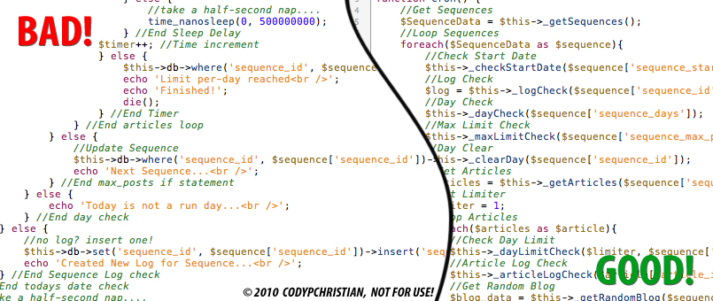
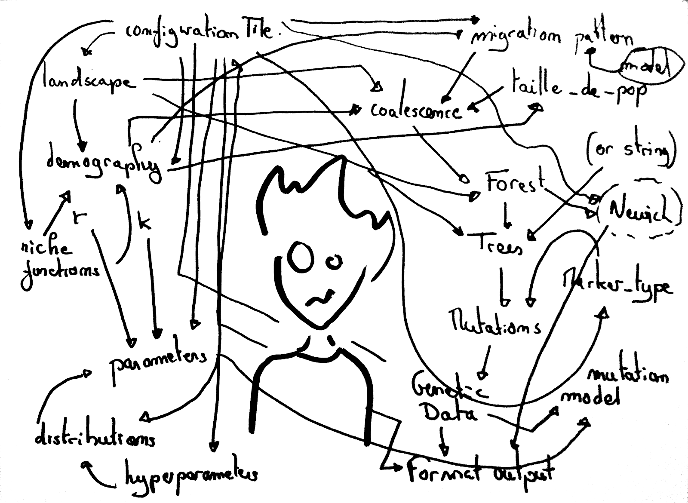

# Estructura Código

En este módulo nos referimos a la estructura y limpieza de código.

Esto es COMPLETAMENTE NECESARIO, ya que debemos de aprender las buenas prácticas de programación desde el inicio.

## ¿Para qué?
La limpieza de código es una de las mejores cosas que puedes hacer mientras estés desarrollando tu proyecto y esto es porque ayuda muchísimo con la **mantenibilidad** y la **continuidad** del código.

Es una forma intuitiva de hacer que tu programa sea legible, para ti mismo dentro de unos meses o para otros desarrolladores.

## Estructura de proyecto
No existe una forma "estándar" de manejar la estructura de tu proyecto, pero existen algunas formas de hacerlo que ayudarán a la organización y limpieza de tu programación.

La estructura en los folders de tu proyecto ayuda mucho a ubicar los archivos y aquí tienes algunas opciones dependiendo del tamaño de tu proyecto y de lo que mejor convenga para el mismo, aquí te dejo algunos ejemplos de estructura.

### Por tipo de archivo
Esta forma de estructurar tu proyecto divide los diferentes archivos por tipo y ayuda para cuando tienes proyectos pequeños para organizar y ubicar donde esté lo que necesitas.

Ejemplo:

- Root
    - assets
        - img
            - img1.png
            - img2.png
        - fonts
        - videos
    - styles
        - file1.css
        - file2.css
    - js
        - file1.js
        - file2.js
    - views
        - file1.html
        - file2.html
    index.html

Esta organización te ayudará mucho para que puedas identificar de forma rápida si necesitas cualquier archivo, pero puede llegar a ser complicado en caso de que tu proyecto crezca y tenga un gran número de archivos porque se complica la búsqueda.

### Por funcionalidad
Este tipo de organización funciona mucho con proyectos más grandes, los cuales tienen varias páginas como parte de su funcionalidad, en este tipo de proyectos ya se utilizan componentes, rutas, librerías externas, etc.

Ejemplo

- Root
    - assets
        - img
            - img1.png
            - img2.png
        - fonts
        - videos
    - styles
        - file1.css
        - file2.css
    - controllers
        - controller1.js
        - controller2.js
    - components
        - component1.js
        - component2.js
    - routes
        - route1.js
        - route2.js
    - views
        - view1.html
        - view2.html
    index.html

Este tipo de estructuras funcionan cuando tu proyecto contiene una gran cantidad de archivos y la arquitectura de desarrollo está segmentada.

### Por ruta
Este tipo de estructura sirve para cuando se programa en equipos que tienen desarrollos independientes, pero que son todos parte de un mismo proyecto, ya que separa los archivos de forma que cada carpeta tenga sus propios archivos.

Ejemplo:

- Root
    - assets
        - img
            - img1.png
            - img2.png
        - fonts
        - videos
    - perfil
        - perfil.css
        - perfil.js
        - perfil.html
        - perfil.test.js
    - feed
        - feed.css
        - feed.js
        - feed.html
        - feed.test.js
    - searchbar
        - searchbar.css
        - searchbar.js
        - searchbar.html
        - searchbar.test.js

Esta estructura funciona para equipos que trabajan en archivos o secciones independientes.

## Buenas Prácticas de código.
Ya vimos como estructurar nuestros proyectos, pero ahora siguen cuales son las recomendaciones al momento de escribir código y evitar cosas como el código espagueti, que así se le llama por estar enredado y nadie lo entienda.

Para eso aquí te dejo varias recomendaciones para que tu código tenga una buena legibilidad y por lo tanto sea mucho más fácil de comprender.

- Enfócate en la legibilidad: Para ayudar al seguimiento y que sea fácil de leer ayudará mucho a optimizar tiempo.
    - Usa la menor cantidad de líneas posible.
    - Usa nombres adecuados para las variables.
    - Segmenta tu código por bloques de funcionalidad.
    - Usa de forma correcta la identación para controlas las estructuras de código.
    - Usa funciones atómicas que no contengan muchas funcionalidades en una sola función.
    - Aplica el principio DRY (Don't Repeat Yourself) en donde las tareas repetitivas hay que usarlas como funciones.
    - Evita la anidación profunda.
- Estandariza la documentación en los comentarios: Usa los comentarios como encabezados de cada una de tus funciones para poder explicar que es lo que hace la función antes de empezar a leer el código, esto ayuda mucho en el futuro cuando quieras revisar el código.
    - Nombre del módulo.
    - Fecha de creación.
    - Autor.
    - Historial de modificaciones.
    - Resumen de funcionalidad.
- Formaliza las Excepciones: Las Excepciones se refiere a todos los problemas, errores o eventos poco comunes que pueden hacer que tu código no funcione de forma correcta o que simplemente rompa tu aplicación, es necesario controlarlas para poder solucionar estos problemas.
    - Siempre usa bloques de Try-Catch.
    - Maneja un proceso de pruebas.
    - Usa registros de actividad que te den información suficiente de en dónde, quien y qué fue lo que pasó en la excepción.
- Estandarizar la forma de escribir código: Cuando se coolabora con más personas en el mismo equipo de desarrollo es necesario tener una misma forma de escribir código, desde las variables hasta las llaves, para eso existen diferentes herramientas para poder controlar el entorno de programación.
    - prettier: Es una extensión de VSCode que acomoda automáticamente tu código (https://prettier.io/)
    - eslint: Herramienta que revisa el código escrito y los revisa con una lista de estándares para poder unificar la forma de programación (https://eslint.org/)

Eso es todo por esta lección, Vámonos a las [prácticas]().

***¡Vámonos hasta el espacio y más allá Explorers!***
