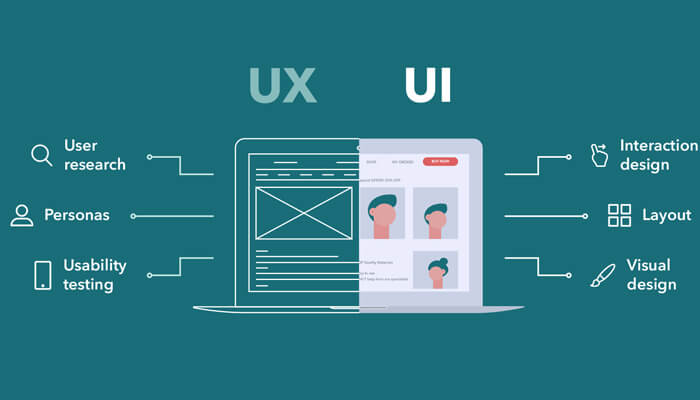

# ¿Qué es FrontEnd?

Hola Explorers!

Esta es la primera de todas las preguntas que veremos durante este curso y de hecho su respuesta es bastante amplia...

## ¿Qué significa Front?

Cuando hablamos de Front nos referimos a la parte de "en frente" de las aplicaciones web, la cual es la capa en la que interactuan los usuarios. 

Esta es la parte que se visualiza en el navegador y es la que manda toda la información al Backend para ser procesada.

Así como se muestra en la imágen en el FrontEnd construimos todo el diseño del sitio, desde la estructura, el acomodo, la distribución de contenido, los estilos que se muestran y los flujos de interacción con nuestros usuarios.

## El usuario

Cuando programamos en FrontEnd tenemos que estar conscientes de que todo lo que hacemos es lo que estará usando una persona y que esta persona es en la que nos tenemos que enfocar.

Para eso existe el UI/UX el cual se refiere a User Interface (Interfaz de usuario) y User experience (Experiencia de usuario), estas son las partes más importantes del diseño de una web que SIEMPRE se tienen que realizar antes de empezar a programar.

## Patrones de arquitectura de desarrollo Web
### MVC (Model View Controller)

Hablaremos de uno de los patrones de diseño web más utilizados y con el que nos quedará muchísimo más claro el cómo funciona todo el tema de que sea FrontEnd, que donde juega nuestra parte es en la parte de la "Vista".

A lo que se refiere MVC es a la separación de la interfaz de usuario (Vista) de la parte de datos y de negocio (Modelo), la cual está intermediada por un controlador (Controller), el controlador realiza las validaciones, sanitizaciones de datos, manejo de errores, entre varias otras cosas que permiten que los datos que se mandan desde la vista lleguen de forma más ordenada y limpia a su procesamiento en el backend que es donde se encuentra el modelo.

Así como este patrón de diseño arquitectónico existen algunos otros como **MVVM, MVP, RMR** y se recomienda que utilices el que sea mejor para tu aplicación.

Eso es todo por esta lección, nos vemos en la [siguiente](./frontEndTecs.md).

***¡Vámonos hasta el espacio y más allá Explorers!***
